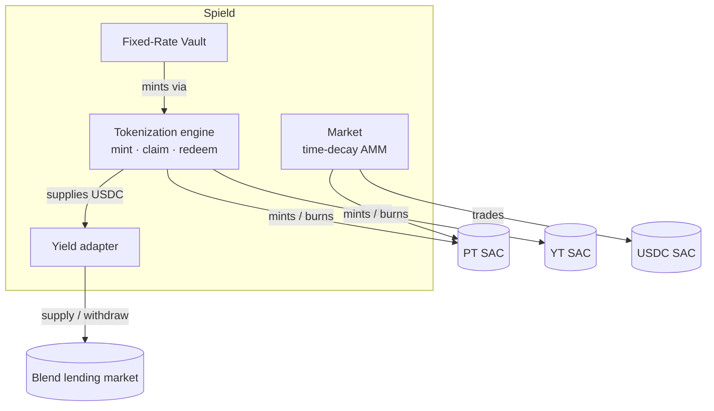

import { Callout } from 'fumadocs-ui/components/callout';

Spield is composed of a few small, single-responsibility contracts. This page maps them at a
high level so you know what talks to what — without diving into internals.

## The contracts

| Contract | Responsibility |
| --- | --- |
| **Tokenization engine** | The core. Takes USDC, routes it to the yield source, mints/burns PT + YT, tracks each position, and enforces solvency. |
| **Yield adapter** | A thin translator between the engine and the external yield source (Blend). It's the only part that knows the yield source's shape. |
| **Fixed-Rate Vault** | A product built *on top of* the engine. Issues fixed-payout receipts backed by PT it holds. |
| **Market** | The time-decay AMM. Trades PT against USDC; YT trades are routed through the engine + market. |

## Key design properties

### The yield source is pluggable
The tokenization engine never hard-codes the yield source — it talks to the **yield adapter**
through a stable interface. That means additional high-quality yield sources can be supported
over time **without changing PT/YT behavior** for users or integrators.

### Products compose, they don't duplicate
The Fixed-Rate Vault and the Market are both *users* of the core engine, not reimplementations
of it. The vault mints PT through the engine; the market trades the PT the engine produces.
This keeps each piece small and independently verifiable.

### The market never touches the yield source
The Market only moves **PT and USDC**. It has no connection to the lending market — which
keeps its surface area minimal. YT exposure is achieved by *routing* (mint via the engine,
then trade PT), not by a separate pool.

<Callout title="Why this matters for integrators">
  You can integrate at whatever layer you need: read solvency from the engine, quote a fixed
  rate from the vault, get a price from the market, or just hold PT/YT as assets. The layers
  are independent, so you only depend on the part you use.
</Callout>

## Trust model (honest summary)

Spield is explicit about what is trustless and what is trusted:

| Area | Trust level |
| --- | --- |
| **Yield & solvency** | **Trustless** — derived from the yield source's real on-chain rate; no privileged party can inflate it, and solvency is enforced on every operation. |
| **User funds** | **Trustless** — no admin can move user funds, mint unbacked tokens, or drain reserves; those paths don't exist. |
| **Admin actions** (pause, set rate/fee within ceilings, upgrades) | **Trusted but bounded** — a pause can only block *new* inflows (exits always stay open); upgrades are **timelocked** to give users an exit window; rates/fees are capped by on-chain ceilings. |
| **Yield source** | **Inherited dependency** — Spield depends on the health of the underlying lending market, stated openly rather than hidden. |

For the safety mechanics in depth, see [Solvency](/docs/how-it-works/solvency) and
[Understanding the risks](/docs/resources/security).

## Verifiable builds

Each contract exposes its **live deployed code hash** on-chain, so anyone can confirm exactly
which build is running and that any upgrade actually took effect. Pause status, admin, and
governance state are all readable too — see [Reading state](/docs/developers/reading-state).
