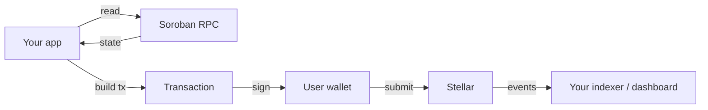

import { Callout } from 'fumadocs-ui/components/callout';
import { Card, Cards } from 'fumadocs-ui/components/card';

Spield is built on **Stellar's Soroban smart contracts**, and its tokens and contracts are
**open and composable**. This section is for developers integrating Spield into an app,
indexing its data, or building products on top of PT and YT.

<Callout title="What this section covers — and doesn't">
  These docs describe Spield's **public interface**: the contract entry points you call, the
  tokens you interact with, the state you can read, and the events you can index. They do not
  cover internal implementation details — you don't need them to integrate.
</Callout>

## Where to start

<Cards>
  <Card title="Architecture" href="/docs/developers/architecture" description="The high-level layout: yield source, tokenization engine, vault, and market." />
  <Card title="Contracts" href="/docs/developers/contracts" description="The public function surface of each contract — reads and writes." />
  <Card title="Tokens" href="/docs/developers/tokens" description="PT, YT, and USDC as Stellar assets / SACs, and how to handle their units." />
  <Card title="Reading state" href="/docs/developers/reading-state" description="Query positions, prices, solvency, and balances — free, no signing." />
  <Card title="Integrating" href="/docs/developers/integrating" description="Build, simulate, sign, and submit transactions from your app." />
  <Card title="Events" href="/docs/developers/events" description="The on-chain events Spield emits, for dashboards and indexers." />
  <Card title="Contract addresses" href="/docs/developers/addresses" description="Live testnet (and upcoming mainnet) contract + token addresses." />
</Cards>

## Tech stack at a glance

| Layer | Technology |
| --- | --- |
| Smart contracts | Soroban (Rust), on Stellar |
| Tokens | Stellar assets, wrapped as Stellar Asset Contracts (SACs) |
| Yield source | Blend lending market (via a thin adapter) |
| Reads | Soroban RPC `simulateTransaction` (free, no signing) |
| Writes | Build → simulate → sign (wallet) → submit → poll |
| Reference client | `@stellar/stellar-sdk` (JS/TS) |

## The shape of an integration

Most integrations follow the same pattern:

- **Reads** are free simulations — query positions, prices, and solvency with no wallet and no fees.
- **Writes** are standard Soroban transactions, signed by the user's wallet.
- **Events** let you reconstruct full protocol state for dashboards or analytics.

## Conventions used in these docs

- **Base units.** All token amounts on-chain are integers in **base units** (USDC, PT, and YT use **7 decimals**). `10000000` base units = `1.0` USDC. See [Tokens](/docs/developers/tokens).
- **Fixed-point rates.** Rates and prices use a 12-decimal fixed-point representation. `implied_apy` of `0.08` means 8%.
- **Function names** are shown exactly as they appear on-chain (snake_case), e.g. `claim_yield`.

<Callout type="info" title="Contract addresses">
  The live testnet (and upcoming mainnet) contract and token addresses are on the
  [Contract addresses](/docs/developers/addresses) page. This documentation focuses on the
  **interface and integration patterns**; wire your app to those addresses via your own
  configuration.
</Callout>
