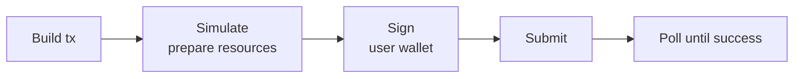

import { Callout } from 'fumadocs-ui/components/callout';
import { Step, Steps } from 'fumadocs-ui/components/steps';

Writing to Spield uses the standard Soroban transaction lifecycle. The user's wallet signs;
your app builds, simulates, submits, and polls. This page shows the pattern.

## The write lifecycle



<Steps>

<Step>
### Build

Construct the contract call (e.g. `mint(user, amount)`), with the user's account as the
source.
</Step>

<Step>
### Simulate / prepare

Simulate to compute the Soroban resource footprint and authorization, then assemble the
prepared transaction. The SDK's `prepareTransaction` does this in one step.
</Step>

<Step>
### Sign

Hand the prepared transaction's XDR to the connected wallet to sign. The user approves in
their wallet popup.
</Step>

<Step>
### Submit & poll

Submit the signed transaction and poll `getTransaction` until it succeeds (or fails).
</Step>

</Steps>

## Reference implementation

```ts
import {
  rpc,
  TransactionBuilder,
  Contract,
  BASE_FEE,
} from '@stellar/stellar-sdk';

const server = new rpc.Server(RPC_URL);

export async function writeContract(
  walletAddress: string,
  contractId: string,
  method: string,
  args: unknown[],
  signXDR: (xdr: string) => Promise<string>, // your wallet adapter
): Promise<string> {
  const account = await server.getAccount(walletAddress);
  const contract = new Contract(contractId);

  // 1. Build
  const tx = new TransactionBuilder(account, {
    fee: BASE_FEE,
    networkPassphrase: NETWORK_PASSPHRASE,
  })
    .addOperation(contract.call(method, ...(args as never[])))
    .setTimeout(60)
    .build();

  // 2. Simulate + prepare (resource fees, footprint, auth)
  const prepared = await server.prepareTransaction(tx);

  // 3. Sign with the user's wallet
  const signedXDR = await signXDR(prepared.toXDR());
  const signed = TransactionBuilder.fromXDR(signedXDR, NETWORK_PASSPHRASE);

  // 4. Submit
  const sent = await server.sendTransaction(signed);
  if (sent.status === 'ERROR') throw new Error('submit failed');

  // 5. Poll
  let res = await server.getTransaction(sent.hash);
  while (res.status === 'NOT_FOUND') {
    await new Promise((r) => setTimeout(r, 1000));
    res = await server.getTransaction(sent.hash);
  }
  if (res.status !== 'SUCCESS') throw new Error('transaction failed');
  return sent.hash;
}
```

## Example write calls

```ts
import { Address, nativeToScVal } from '@stellar/stellar-sdk';

const addr = (a: string) => new Address(a).toScVal();
const i128 = (n: bigint) => nativeToScVal(n, { type: 'i128' });
const u64 = (n: number) => nativeToScVal(BigInt(n), { type: 'u64' });
const toBase = (h: string) => BigInt(Math.round(parseFloat(h) * 1e7));

// Deposit 100 USDC → mint PT + YT
await writeContract(wallet, WRAPPER_ID, 'mint',
  [addr(wallet), i128(toBase('100'))], signXDR);

// Claim a position's yield
await writeContract(wallet, WRAPPER_ID, 'claim_yield',
  [u64(positionId)], signXDR);

// Lock a fixed rate via the vault
await writeContract(wallet, VAULT_ID, 'deposit',
  [addr(wallet), i128(toBase('100'))], signXDR);

// Buy PT on the market (min-out from a prior quote)
await writeContract(wallet, MARKET_ID, 'swap_exact_usdc_for_pt',
  [addr(wallet), i128(toBase('100')), i128(minPtOut)], signXDR);
```

## Multi-step flows (routing)

Some user actions are **two transactions** under one UX action. The most common is
**buying YT** ("Long Yield"):

1. `mint(user, usdc)` on the engine → user gets PT + YT.
2. `swap_exact_pt_for_usdc(user, pt, minOut)` on the market → sell the PT back, keep the YT.

Run them in sequence, surface progress as "Step 1/2 / 2/2", and refresh state once at the end.
Because step 1 may land even if step 2 fails, re-read state on failure too so your UI reflects
reality.

## Wallet signing

Use any Stellar wallet adapter (Freighter, xBull, Rabet, Hana, LOBSTR, Albedo). Each exposes a
`signTransaction(xdr)` you can wrap as the `signXDR` callback above. Always sign with the
correct **network passphrase**, and verify the user's wallet is on the right network before
building.

<Callout type="warn" title="Always simulate before signing">
  `prepareTransaction` both computes resource fees and reveals if the call would fail
  (insufficient balance, slippage, capacity, paused). Surface simulation errors to the user
  *before* asking them to sign — it's a better UX and avoids wasted fees.
</Callout>

## Handling common errors

| Situation | What you'll see | Handle by |
| --- | --- | --- |
| Slippage exceeded | Simulation/exec error | Re-quote and/or widen the user's slippage tolerance. |
| Amount exceeds liquidity | Quote returns `0` | Tell the user the trade is too large for current liquidity. |
| Paused | Inflow call fails | Inform the user new deposits are paused; exits still work. |
| Not matured | `redeem_pt` fails before maturity | Offer `combine_and_redeem` for an early exit instead. |
| Missing trustline | Mint fails | Ensure the recipient has PT/YT trustlines first. |

Next: index protocol activity with [events](/docs/developers/events).
