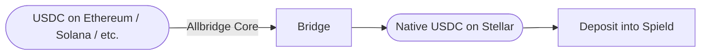

import { Callout } from 'fumadocs-ui/components/callout';
import { Step, Steps } from 'fumadocs-ui/components/steps';

Most people's USDC lives on another chain. Spield's built-in **cross-chain bridge** lets you
bring it to Stellar in a few clicks, so you can deposit without first routing through an
exchange. It's powered by **Allbridge Core**.

<Callout type="info" title="The bridge is a convenience at the edge — not part of the core">
  The bridge only moves funds **to** Stellar. Once your USDC arrives, it's native Stellar
  USDC and everything Spield does with it is bridge-free. Your Spield position never carries
  an ongoing cross-chain dependency. (See [Why Stellar?](/docs/introduction/why-stellar).)
</Callout>

## Supported source chains

You can bring USDC to Stellar from:

| Chain | Wallet you'll connect |
| --- | --- |
| **Ethereum** | An EVM wallet (e.g. via WalletConnect) |
| **BNB Smart Chain (BSC)** | An EVM wallet |
| **Polygon** | An EVM wallet |
| **Arbitrum** | An EVM wallet |
| **Solana** | A Solana wallet |
| **Tron** | A Tron wallet |

The destination is always your **Stellar** wallet.

## How to bridge

<Steps>

<Step>
### Open the Bridge page

In the Spield app sidebar, select **Bridge**.
</Step>

<Step>
### Choose the source chain

Pick where your USDC currently lives (Ethereum, Solana, etc.) and connect that chain's wallet
when prompted.
</Step>

<Step>
### Enter an amount and review the quote

Type how much USDC to move. The bridge shows a live quote including fees and the amount you'll
receive on Stellar.
</Step>

<Step>
### Confirm on the source chain

Approve the transfer in your source-chain wallet. The bridge handles the cross-chain
movement.
</Step>

<Step>
### Receive native USDC on Stellar

Your USDC arrives in your Stellar wallet as native USDC — ready to deposit into Spield.
</Step>

</Steps>

## Flow at a glance

## Good to know

- **Fees and timing** depend on the source chain and current network conditions; the quote shows them before you confirm.
- **You'll need a small amount of the source chain's gas token** (e.g. ETH on Ethereum) to send the bridge transaction.
- **Always review the quote** and the destination address before confirming.

<Callout type="warn" title="Bridging carries its own risks">
  Cross-chain bridges are a distinct piece of infrastructure with their own risk profile.
  Spield integrates a reputable provider (Allbridge Core), but bridging is inherently
  higher-risk than a same-chain transfer. If you prefer, you can instead withdraw USDC
  directly on Stellar from an exchange — see [funding your wallet](/docs/getting-started/funding-your-wallet).
</Callout>

## Related

- Walkthrough: [Bridge USDC to Stellar](/docs/guides/bridge-usdc)
- After bridging: [Your first deposit](/docs/getting-started/your-first-deposit)
