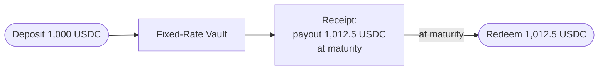

import { Callout } from 'fumadocs-ui/components/callout';
import { Step, Steps } from 'fumadocs-ui/components/steps';

The **Fixed-Rate Vault** is the simplest way to use Spield, and the product most people will
want. You deposit USDC, you're told an exact payout for an exact date, and you receive a
**receipt** for it. That's the entire experience — no PT, no YT, no trading.

## What it does

> Deposit USDC → get a guaranteed payout at maturity.

When you deposit, the vault:

1. Shows you a **live quote**: your guaranteed payout (principal + a fixed coupon) and the fixed APY.
2. Issues you a **receipt** for that exact payout.
3. At maturity, lets you **redeem** the receipt for the full amount in USDC.

## Why the rate is truly fixed

The vault doesn't *predict* a rate and hope. It only ever promises a payout it is **already
holding the means to pay**. Under the hood it backs every receipt with principal-tokens it
holds in inventory, so a payout can only be quoted if the backing for it already exists. If
it can't fully back a deposit's payout, it declines the deposit rather than over-promise.

<Callout title="The practical effect">
  Your payout is locked the instant you deposit. Market rates can swing wildly afterward —
  your receipt still pays out exactly what it said. You also can't be liquidated; there's no
  leverage in a vault deposit.
</Callout>

## Using the vault

<Steps>

<Step>
### Open the Fixed Vault page

In the app sidebar, select **Fixed Vault**.
</Step>

<Step>
### Enter an amount and read the quote

Type your USDC amount. The vault shows your **guaranteed payout** and **fixed APY** for the
current term.
</Step>

<Step>
### Deposit

Confirm and approve in your wallet. You receive a receipt.
</Step>

<Step>
### Redeem at maturity

After the maturity date, return to the vault, find your receipt, and **redeem** it for the
full payout in USDC.
</Step>

</Steps>

## Good to know

- **One term at a time.** Each vault targets a single maturity date. When that term ends, a new term is offered.
- **The fixed rate may change for *new* deposits.** Spield can adjust the quoted rate for future deposits (within an on-chain ceiling), but **already-issued receipts never change** — your locked payout is yours.
- **Capacity.** The vault can only promise as many fixed payouts as it can back. In rare high-demand moments it may show limited capacity; this is the safety mechanism that keeps every receipt fully covered.

<Callout type="info" title="Want more control?">
  If you'd rather hold the bond yourself (to trade it, LP with it, or claim yield directly),
  use the [Deposit page to mint PT + YT](/docs/features/pt-yt-tokens) instead. The vault is
  the hands-off option; PT/YT is the hands-on one.
</Callout>

## Related

- Walkthrough: [Earn a fixed yield](/docs/guides/earn-fixed-yield)
- Concept: [PT and YT explained](/docs/how-it-works/pt-and-yt)
