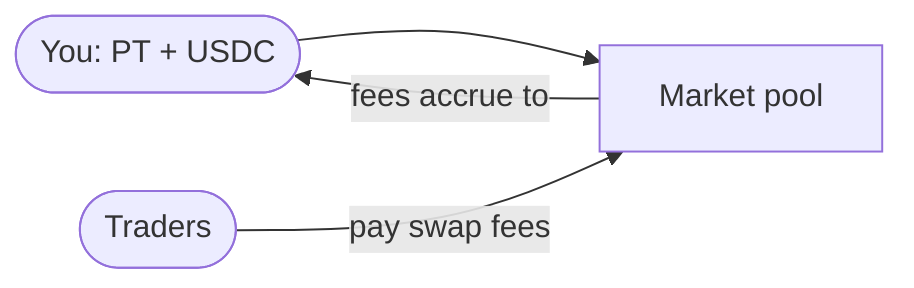

import { Callout } from 'fumadocs-ui/components/callout';
import { Step, Steps } from 'fumadocs-ui/components/steps';

**Liquidity providers (LPs)** supply assets to the market so others can trade, and earn a
share of the **swap fees** in return. Spield's time-decay design makes LPing unusually
attractive: hold to maturity and you face **near-zero impermanent loss**.

## What you provide

You supply a balanced amount of **PT + USDC** to the market. In return you receive **LP
shares** representing your proportional claim on the pool. Your shares earn a cut of every
swap fee, growing your claim over time.

## The impermanent-loss advantage

On a normal AMM, providing liquidity to an asset that's steadily appreciating (like PT
rising to par) guarantees impermanent loss — you'd systematically sell the appreciating asset
too cheaply.

Spield's market is built around PT's predictable path to par, so the curve **anticipates**
that move instead of fighting it. The result:

<Callout title="Near-zero IL at maturity">
  An LP who provides liquidity and **holds to maturity** bears minimal impermanent loss for
  PT's predictable march to par — while still collecting swap fees the whole time. That's the
  core reason to LP on Spield.
</Callout>

This is "near-zero," not "zero": short-term price moves from unexpected yield changes still
cause some divergence if you exit early. The benefit is strongest for LPs who stay to
maturity.

## Adding liquidity

<Steps>

<Step>
### Open the Liquidity page

Select **Liquidity** in the app sidebar.
</Step>

<Step>
### Enter an amount

Enter how much you want to add. The app automatically mirrors the correct amount of the other
asset at the pool's current ratio, so your deposit doesn't move the price.
</Step>

<Step>
### Confirm

Approve in your wallet. You receive LP shares and start earning fees on the next trade.
</Step>

</Steps>

## Removing liquidity

You can **remove liquidity at any time** — including after maturity — and there's no lock-up.
Use the percentage slider to withdraw part or all of your position; you receive your
proportional PT and USDC back, plus the fees your shares accrued.

<Callout type="info" title="LPs can always exit">
  Removing liquidity is never blocked — not by maturity, not by an emergency pause. Your funds
  are always withdrawable.
</Callout>

## Things to keep in mind

- **You need PT to provide liquidity.** Get it by [minting PT + YT](/docs/features/pt-yt-tokens) or buying PT on the market.
- **Fees vary with volume.** Your return depends on how much trading flows through the pool.
- **Balanced deposits.** Adding at the pool's current ratio keeps things fair for everyone and avoids price impact.

## Related

- Walkthrough: [Provide liquidity](/docs/guides/provide-liquidity)
- The venue you're providing to: [The yield market](/docs/features/yield-market)
