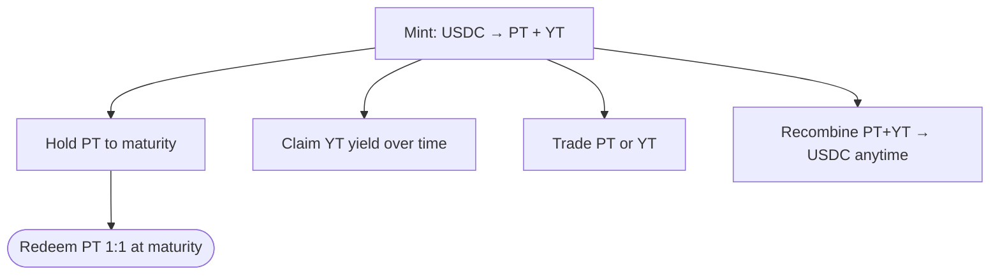

import { Callout } from 'fumadocs-ui/components/callout';

PT and YT are the core building blocks of Spield. Unlike the Fixed-Rate Vault (which keeps
them behind the scenes), the **Deposit** flow mints them straight to your wallet so you can
use them however you like.

## They're real, composable assets

PT and YT are **real Stellar assets** — not abstract balances locked inside a contract. That
means they:

- show up in your wallet,
- can be transferred,
- can be traded on Spield's market,
- can be supplied as liquidity,
- and can be used by other apps that integrate Spield.

| Token | Symbol | Represents |
| --- | --- | --- |
| Principal Token | **PT** | Your principal — redeems 1:1 for USDC at maturity. |
| Yield Token | **YT** | All yield the position earns until maturity. |

## Minting PT + YT

On the **Deposit** page, deposit USDC and the protocol mints **equal amounts** of PT and YT
to your wallet (e.g. 100 USDC → 100 PT + 100 YT). Your USDC starts earning yield immediately.

## What you can do with them

### Hold PT for a fixed return
Keep PT to maturity and redeem it 1:1 for USDC. The discount you effectively paid is your
locked return.

### Claim YT yield
At any time, **claim** the yield your YT has accrued. It pays out in USDC, and your YT keeps
earning until maturity. You can claim as often as you like.

### Redeem PT at maturity
At or after the maturity date, redeem PT for USDC at par (1:1).

### Recombine to exit early
Hold equal PT + YT and **combine** them back into USDC any time — even before maturity.
Spield claims any pending yield first, so you lose nothing. This is the clean "exit early"
path.

### Trade either token
Sell PT for a quick exit at the current market price, or buy more PT for additional fixed
exposure. YT is traded through the market's routing too — see the
[yield market](/docs/features/yield-market).

## Position-level accounting

Each deposit you make is tracked as its own **position**, with its own starting point for
measuring yield. This is what makes Spield's accounting precise: yield is always measured
from the moment *your* position began, so you only ever earn what your deposit actually
generated — never more, never less.

<Callout title="Why this matters">
  Precise per-position accounting is the reason transferring or trading these tokens is safe:
  a new holder can only ever claim yield that accrued *after* they acquired the position, not
  before. No yield is double-counted or fabricated.
</Callout>

## A note on trustlines

Because PT and YT are real Stellar assets, your account establishes a one-time trustline to
each before holding them. **The app handles this for you** on your first deposit with a single
approval — see [funding your wallet](/docs/getting-started/funding-your-wallet#a-note-on-trustlines-its-automatic).

## Related

- Concept deep-dive: [PT and YT explained](/docs/how-it-works/pt-and-yt)
- Build with them: [Spield's tokens for developers](/docs/developers/tokens)
