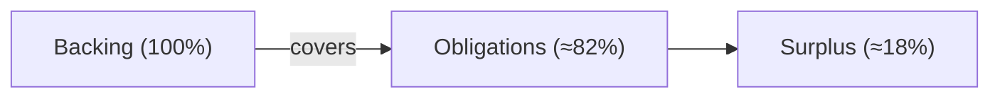

import { Callout } from 'fumadocs-ui/components/callout';

The **Solvency dashboard** is Spield's transparency feature. It turns the protocol's
[solvency invariant](/docs/how-it-works/solvency) into something you can watch live, so you
never have to take safety on faith.

## What it shows

The dashboard reads three figures **directly from the chain**, in real time:

| Figure | Meaning |
| --- | --- |
| **Backing** | The live value of the protocol's entire yield position. |
| **Obligations** | Everything owed — total principal + unclaimed yield. |
| **Surplus** | How much backing exceeds obligations (the safety margin). |

It presents these as clear meters: as long as **Backing ≥ Obligations**, the protocol is
fully solvent — which, by design, it always is.

## Why it's trustworthy

This isn't a marketing number or a periodically-updated report. The dashboard:

- **Reads live on-chain state** — what you see is the protocol's actual position right now.
- **Is permissionless to verify** — anyone can query the same figures directly from the contract, with no special access.
- **Reflects the same data the protocol enforces** — the on-chain check that rejects any unsafe transaction uses these same numbers.

<Callout title="Don't trust — verify">
  Because the figures come straight from the chain, you (or anyone) can independently confirm
  Spield's solvency at any moment. See [reading protocol state](/docs/developers/reading-state)
  for how to query it yourself in code.
</Callout>

## An independent watchtower

In addition to the on-chain enforcement and the public dashboard, an **off-chain monitor**
continuously polls the solvency figures and can raise an alert if the surplus ever shrank
toward zero. It's a third, independent safety layer — out-of-band from the contract itself.

## Where to find it

Open the **Solvency** page in the app's sidebar. It updates as deposits, claims, and
redemptions happen.

## Related

- The mechanism behind it: [Solvency](/docs/how-it-works/solvency)
- Query it yourself: [Reading protocol state](/docs/developers/reading-state)
