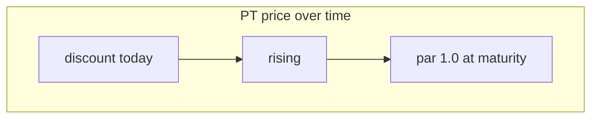

import { Callout } from 'fumadocs-ui/components/callout';
import { Tab, Tabs } from 'fumadocs-ui/components/tabs';

The **market** is where PT and YT change hands. It's a purpose-built **time-decay AMM** —
an automated market maker whose pricing understands that PT marches to par and YT decays to
zero as maturity approaches. You never see raw curve math; you see two simple flows and a
headline rate.

## The headline: implied APY

The market's main number is the **implied APY** — the annualized return you'd lock in by
buying PT right now and holding to maturity. It's derived live from the PT price and the time
remaining, and it updates as people trade.

<Callout title="Implied vs realized">
  The **implied APY** is the market's current expectation of yield. The **realized APY** is
  what actually accrues. A gap between them is the opportunity: if you think realized yield
  will beat the implied number, that's a reason to go long yield (buy YT); if you think it'll
  fall, lock the fixed rate (buy PT).
</Callout>

## Two human flows

The market presents trading as two clear actions rather than as buy/sell of abstract tokens.

<Tabs items={['Earn Fixed', 'Long Yield']}>

<Tab value="Earn Fixed">

**Earn Fixed** = buy PT. You pay USDC, receive PT at a discount, and hold it to maturity for
a guaranteed return at today's implied APY.

- Best for: savers who want certainty and like the current fixed rate.
- Result: a known return, locked in.
- To exit before maturity: sell the PT back at the then-current price.

</Tab>

<Tab value="Long Yield">

**Long Yield** = get leveraged YT exposure. Behind one click, the protocol mints PT + YT from
your USDC and sells the PT back into the market, leaving you holding **YT** for a small net
cost. A little capital buys exposure to the yield of a much larger position.

- Best for: traders who think realized yield will exceed the implied APY.
- Result: amplified upside if yields run hot; YT can decay to zero if they don't.
- This is the higher-risk flow — see [risks](/docs/resources/security).

</Tab>

</Tabs>

## Why a *time-decay* curve?

A normal AMM (like a constant-product DEX) has no concept of time. It would force liquidity
providers to fight against PT's natural rise to par — guaranteeing them losses. Spield's curve
is different: it **expects** PT to drift to par and YT to zero, and prices accordingly.

The practical payoff:

- **Traders** get prices that reflect the real, time-aware value of PT and YT.
- **Liquidity providers** who hold to maturity bear **near-zero impermanent loss** for PT's predictable march to par (see [Liquidity](/docs/features/liquidity)).

## Slippage and quotes

Every trade shows a **live quote** before you confirm, and you can set a **slippage
tolerance** (e.g. 0.5% / 1% / 2%) so a trade only executes within the price you accept. If a
trade would exceed available liquidity, the app tells you instead of failing silently.

## Trading stops at maturity

Once a market reaches maturity, trading halts — there's nothing left to price, since PT is
simply redeemable 1:1 for USDC. Liquidity providers can still withdraw at any time, including
after maturity.

## Related

- Walkthroughs: [Earn a fixed yield](/docs/guides/earn-fixed-yield) · [Go long on yield](/docs/guides/long-yield)
- Earn fees from this market: [Liquidity](/docs/features/liquidity)
