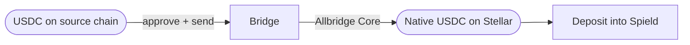

import { Callout } from 'fumadocs-ui/components/callout';
import { Step, Steps } from 'fumadocs-ui/components/steps';

If your USDC lives on another chain, Spield's built-in bridge brings it to Stellar so you can
deposit. It's powered by **Allbridge Core**. For the feature overview, see
[Cross-chain bridge](/docs/features/cross-chain-bridge).

## Before you start

- Have **USDC** on a [supported source chain](/docs/features/cross-chain-bridge#supported-source-chains).
- Have a little of that chain's **gas token** (e.g. ETH on Ethereum) to send the transaction.
- Have a **Stellar wallet** ready to receive — it's the destination.

## Walkthrough

<Steps>

<Step>
### Open the Bridge page

Select **Bridge** in the Spield app sidebar.
</Step>

<Step>
### Pick the source chain

Choose where your USDC is now (Ethereum, BSC, Polygon, Arbitrum, Solana, or Tron). Connect
that chain's wallet when prompted.
</Step>

<Step>
### Enter the amount and review

Type how much USDC to bring over. The bridge shows a **live quote**: fees and the amount
you'll receive on Stellar. Review it carefully.
</Step>

<Step>
### Confirm on the source chain

Approve the transfer in your source-chain wallet. (You may first approve the token, then the
transfer — two signatures on some chains.)
</Step>

<Step>
### Receive on Stellar

After the bridge completes, your **native Stellar USDC** lands in your Stellar wallet. You're
ready to [deposit into Spield](/docs/getting-started/your-first-deposit).
</Step>

</Steps>

## Good to know

- **Timing varies** by source chain and network conditions; the quote reflects current estimates.
- **Double-check the destination** is your own Stellar address before confirming.
- **Keep some XLM** in your Stellar wallet for the eventual deposit's network fee.

<Callout type="warn" title="Bridges carry their own risk">
  Cross-chain bridges are separate infrastructure with their own risk profile. If you'd rather
  avoid bridging, withdraw USDC directly on the Stellar network from an exchange instead — see
  [funding your wallet](/docs/getting-started/funding-your-wallet).
</Callout>

## Alternative: from an exchange

Many exchanges let you withdraw USDC **directly on Stellar** — pick the Stellar network when
withdrawing and paste your Stellar address. This skips bridging entirely. Details in
[funding your wallet](/docs/getting-started/funding-your-wallet).
