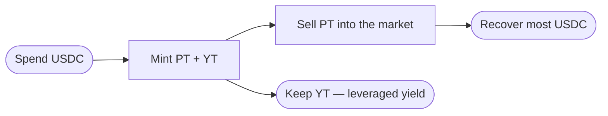

import { Callout } from 'fumadocs-ui/components/callout';
import { Step, Steps } from 'fumadocs-ui/components/steps';

Going "long yield" means betting that the **realized** yield will be **higher** than the
market's current **implied APY**. You express it by holding **YT**. This is the higher-risk,
higher-upside side of Spield.

<Callout type="warn" title="This is an advanced, higher-risk flow">
  YT can decay to zero by maturity if the position earns little. Only go long yield if you
  understand that you can lose the amount you put in. Read [Understanding the risks](/docs/resources/security)
  first.
</Callout>

## The idea in one line

Buy YT cheaply → if yields run hotter than the market expects, your YT earns more than you
paid. A small amount of USDC controls the yield of a much larger position — that's the
leverage.

## How the Long Yield flow works

Behind a single click, the app:

1. Mints PT + YT from your USDC (via the engine), then
2. Sells the PT back into the market,

leaving you holding **YT** for a small net cost.

## Walkthrough

<Steps>

<Step>
### Open Markets → Long Yield

Select **Markets**, then switch to the **Long Yield** tab.
</Step>

<Step>
### Enter how much to spend

Type the USDC amount. The app previews:

- **YT received** — your yield exposure,
- **USDC recovered** — from selling the PT,
- **net cost** — what you actually pay, and
- an approximate **leverage** figure.
</Step>

<Step>
### Confirm the routed trade

Approve the steps in your wallet. The app runs them in sequence and shows progress ("Step
1/2 / 2/2"), then refreshes once complete.
</Step>

<Step>
### Manage your YT

Your YT now earns yield to maturity. **Claim** accrued yield in USDC whenever you like; the
YT keeps earning. You can also sell or recombine to exit.
</Step>

</Steps>

## When does YT pay off?

YT is profitable when the yield it collects (plus any value left at exit) exceeds your net
cost. In short:

| Scenario | YT outcome |
| --- | --- |
| Realized yield **beats** the implied APY | YT wins — you captured the upside. |
| Realized yield ≈ implied APY | Roughly break-even. |
| Realized yield **falls short** | YT underperforms; it can decay toward zero by maturity. |

## Claiming yield

You don't have to wait for maturity to take profit. Open your position and **claim** — Spield
pays the accrued yield in USDC and your YT keeps running. Claim as often as you like.

## Exiting

- **Sell YT** back through the market (routed), or
- **Recombine** equal PT + YT into USDC if you hold both.

Next, the income side: [provide liquidity](/docs/guides/provide-liquidity).
