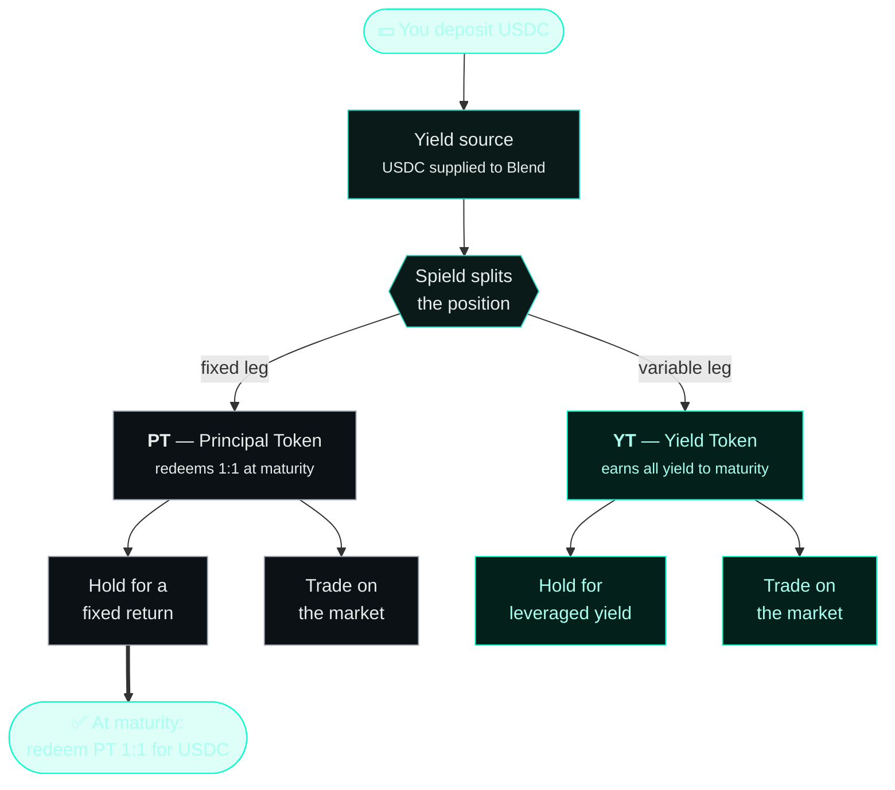

import { Callout } from 'fumadocs-ui/components/callout';
import { Card, Cards } from 'fumadocs-ui/components/card';

This section explains how Spield works at a level you can fully understand without reading
any code. We'll go from a single deposit all the way to redemption.

## The big picture

Spield does three things, in order: **source** real yield, **split** it, and let you
**trade or hold** the pieces.

The key insight: **the value behind your tokens is a real position that grows on its own.**
Spield never has to invent or top up a number — the backing increases automatically as the
underlying lending position earns interest.

## The three layers

Spield is built as a few simple, independent layers. You only ever interact with the top
ones; the lower ones do the heavy lifting.

| Layer | What it does | You see it as |
| --- | --- | --- |
| **Yield source** | Supplies your USDC to Stellar's Blend market so it earns real interest. | "My deposit is earning yield." |
| **Tokenization** | Splits the yield-bearing position into PT + YT and tracks each deposit. | "I hold a PT and a YT." |
| **Products & market** | The Fixed-Rate Vault (one-click fixed return) and the time-decay AMM (trading). | "I locked a fixed rate" / "I traded PT." |

Because the layers are separate, the simple products (like the Fixed-Rate Vault) work on
their own even without using the trading market.

## Read on

<Cards>
  <Card title="PT and YT explained" href="/docs/how-it-works/pt-and-yt" description="What the two tokens are, how they're priced, and why they always add up." />
  <Card title="The yield source" href="/docs/how-it-works/yield-source" description="Where the real yield comes from and why the backing genuinely grows." />
  <Card title="Solvency" href="/docs/how-it-works/solvency" description="Why the protocol can always pay everyone — and how you can verify it live." />
  <Card title="The protocol lifecycle" href="/docs/how-it-works/lifecycle" description="A full timeline from deposit to maturity to redemption." />
</Cards>
