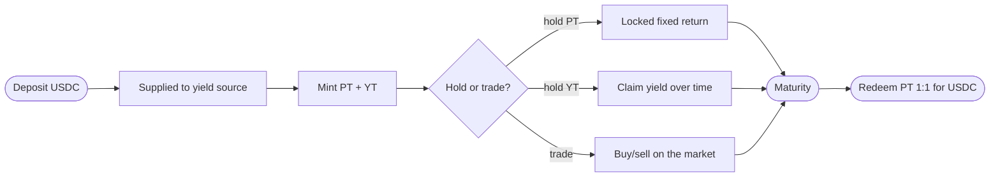

import { Callout } from 'fumadocs-ui/components/callout';
import { Step, Steps } from 'fumadocs-ui/components/steps';

Here's the whole journey of value through Spield, end to end. Everything else in the docs is
detail on one of these stages.

## The timeline

## Stage by stage

<Steps>

<Step>
### Deposit

You deposit USDC. It's immediately supplied to the yield source and begins earning real
interest. In return you receive equal amounts of **PT** and **YT** (or, via the Fixed-Rate
Vault, a single receipt for a guaranteed payout).
</Step>

<Step>
### Earn & manage (before maturity)

While the market is open, you have choices:

- **Hold PT** to lock in your fixed return.
- **Hold YT** and **claim** its accrued yield in USDC whenever you like — the YT keeps earning.
- **Trade** PT or YT on the market as your view changes.
- **Provide liquidity** (PT + USDC) to earn swap fees.
- **Recombine** equal PT + YT back into USDC to exit early.
</Step>

<Step>
### Approach maturity

As the maturity date nears, prices converge predictably: **PT drifts up to par (1.0)** and
**YT decays toward zero**. The trading market is built around exactly this path, so liquidity
providers who hold to maturity face minimal impermanent loss.
</Step>

<Step>
### Maturity

At the maturity date, the market stops trading (there's nothing left to price — PT is about
to be worth exactly 1 USDC). PT becomes **redeemable 1:1**.
</Step>

<Step>
### Redeem

You redeem your PT for USDC at par, and a Fixed-Rate Vault receipt for its full guaranteed
payout. Any YT yield you hadn't claimed can be settled. Your position is complete.
</Step>

</Steps>

## A worked example

Say you deposit **1,000 USDC** into the Fixed-Rate Vault at a 5% fixed APY for a 90-day term:

| Moment | What happens |
| --- | --- |
| **Day 0** | Deposit 1,000 USDC. You get a receipt for a guaranteed payout of ~1,012.5 USDC at maturity. |
| **Days 1–89** | Your USDC earns real yield in the background. Your payout is already locked — it doesn't change. |
| **Day 90 (maturity)** | You redeem the receipt for the full ~1,012.5 USDC. |

The exact figures depend on the rate and term shown at deposit time; the point is that the
payout is **known and fixed from day 0**.

<Callout title="What if you want out early?">
  You're never locked in against your will. On the PT/YT path you can sell on the market or
  recombine PT + YT to exit any time. The fixed return is what you get if you *hold to
  maturity* — leaving early means taking the current market price instead.
</Callout>

## Where to go next

- See the products that wrap this lifecycle into one-click flows → [Features](/docs/features)
- Follow a concrete walkthrough → [Guides & Tutorials](/docs/guides)
- Build on top of it → [Developers](/docs/developers)
