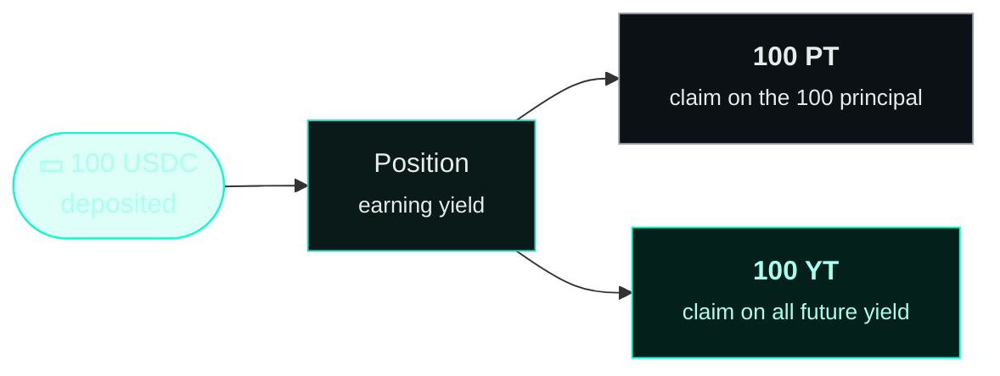
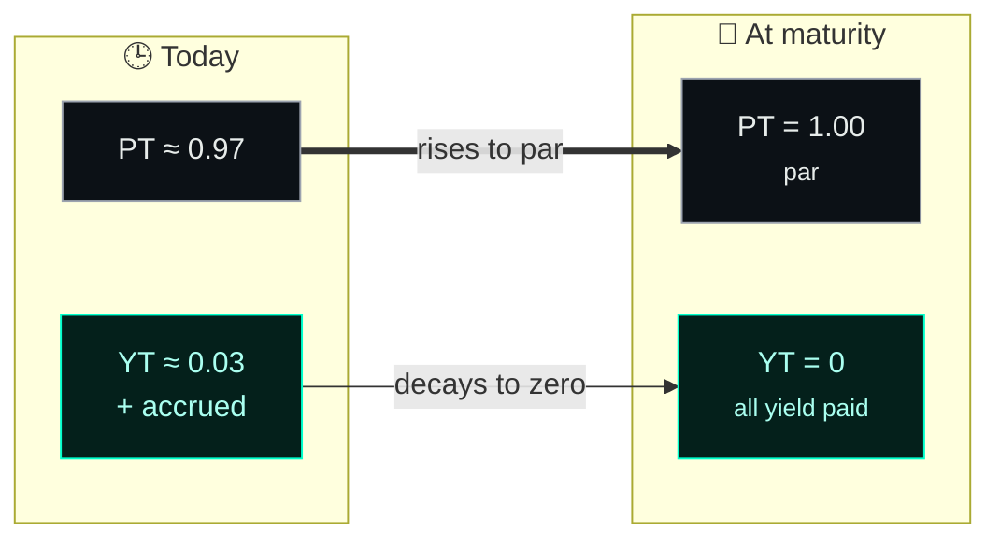

import { Callout } from 'fumadocs-ui/components/callout';
import { Tab, Tabs } from 'fumadocs-ui/components/tabs';

When you deposit USDC, Spield mints two tokens in equal amounts: a **Principal Token (PT)**
and a **Yield Token (YT)**. This is the heart of the protocol, so let's make it concrete.

## The split

Imagine you deposit **100 USDC**. That USDC is supplied to the yield source and starts
earning interest. Spield then represents your position as two separate claims:

- **PT** is your claim on the **principal**. Each PT redeems for exactly **1 USDC at maturity**.
- **YT** is your claim on the **yield**. It collects everything the position earns until maturity.

You now hold 100 PT and 100 YT. You can keep both, sell one, or trade them separately.

<Callout title="The invariant">
  **Value(position) = Value(PT) + Value(YT)** — always. Splitting never changes the total
  value; it just hands you two pieces you can manage independently.
</Callout>

## PT — the fixed-rate bond

A PT behaves exactly like a **zero-coupon bond**:

- It's worth **1 USDC at maturity** (its "par" value).
- Before maturity it trades at a **discount** — say 0.97 USDC.
- That discount is your **fixed return**: buy at 0.97, redeem at 1.00, keep the difference.

As time passes and maturity nears, a PT's market price drifts **up toward par (1.0)**,
because it's getting closer to being redeemable for a full 1 USDC.

<Tabs items={['What you earn', 'When you can redeem']}>
<Tab value="What you earn">
Your return is fixed the moment you buy. If 1 PT costs 0.97 and matures in 90 days, you earn
**~3.1% over 90 days** (≈ 12.5% annualized) — no matter what happens to rates afterward.
</Tab>
<Tab value="When you can redeem">
PT redeems **1:1 for USDC at or after maturity**. Before maturity you can't redeem it for
par, but you *can* sell it on the market at its current price, or recombine it with YT to
exit early (see below).
</Tab>
</Tabs>

## YT — the yield token

A YT is a claim on **all the yield** the position earns until maturity. Because it's cheap
relative to the exposure it represents, it's a **leveraged** way to bet on yield:

- A small amount of USDC buys YT covering the yield of a much larger position.
- If realized yield **beats** the market's expectation, YT is profitable.
- If realized yield **underperforms**, YT can decay toward zero by maturity.

You can **claim** the yield a YT has accrued at any time — it pays out in USDC, and the YT
keeps earning until maturity.

<Callout type="warn" title="YT is the higher-risk leg">
  YT is for users with a view on yield. Its value can fall to zero at maturity if the
  position earned little. That's the trade-off for its leverage — read
  [Understanding the risks](/docs/resources/security).
</Callout>

## How they relate over time

Here's the intuition for the whole life of a market, holding yield expectations constant:

- **PT climbs to par.** Its price predictably rises to 1.0.
- **YT decays to zero.** Its remaining-yield claim shrinks as there's less time left, but it
  pays out the yield it earned along the way.

This predictable "time decay" is exactly what the [yield market](/docs/features/yield-market)
is built to price.

## Recombining (exit early)

If you hold **equal amounts of PT and YT**, you can **combine** them back into USDC at any
time — even before maturity — because together they're just the original position again.
Spield automatically claims any pending yield first, so nothing is lost. This is your
"undo": PT + YT → USDC.

## Recap

| | PT (Principal Token) | YT (Yield Token) |
| --- | --- | --- |
| Represents | Your principal | All future yield |
| Redeems for | 1 USDC at maturity | Yield, claimable any time |
| Price over time | Rises toward par (1.0) | Decays toward 0 |
| Risk | Low — a bond | Higher — leveraged on yield |
| Best for | Savers wanting certainty | Traders with a yield view |

Next: [where the yield actually comes from](/docs/how-it-works/yield-source).
