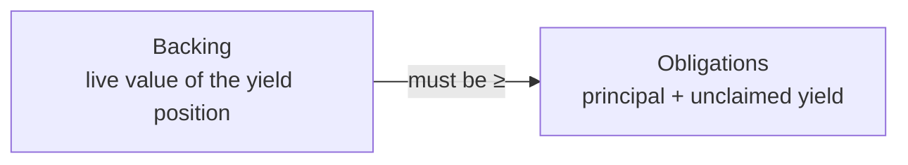

import { Callout } from 'fumadocs-ui/components/callout';

"Solvent" means the protocol holds enough to pay back everyone it owes. Spield is designed so
that this is **always true**, and so that **anyone can verify it** at any time.

## The invariant

At every moment, Spield maintains a simple rule:

<Callout title="The solvency invariant">
  **Backing ≥ everything owed.** The live value of the protocol's yield position is always at
  least the total principal owed to PT holders plus the unclaimed yield owed to YT holders.
</Callout>

In plain terms: the money behind the tokens is never less than the money the tokens
represent. Expressed as a picture:

## Why it holds by construction

This isn't a promise that has to be monitored — it's a property of how Spield works:

1. **The backing only grows.** The yield position's value rises automatically as interest accrues; it never silently shrinks.
2. **Yield payouts come from the growth, never the principal.** When a YT holder claims, Spield withdraws exactly the earned yield, leaving principal backing intact.
3. **PT redemptions are 1:1.** A PT redeems for the principal the position already holds for it.

Because new tokens are only ever minted against freshly-deposited USDC (which is immediately
supplied to the yield source), there's never a moment where more is owed than is held.

## Checked on every operation

On top of the design guarantee, the protocol **re-checks the invariant after every
state-changing action** — every mint, claim, redemption, and recombine. If any operation
would ever leave backing below obligations, that transaction is **rejected automatically**.
There's no path that can quietly break solvency.

## How you can verify it — live

You don't have to trust any of the above. Spield exposes a **public solvency view** that
returns, in real time and directly from the chain:

| Figure | Meaning |
| --- | --- |
| **Backing** | The live value of the protocol's whole yield position. |
| **Principal** | Total principal owed to all PT holders. |
| **Unclaimed yield** | Yield earned but not yet claimed (≈ backing − principal). |

The app's **Solvency** page reads these and shows the surplus visually. Because it's a live
on-chain read, what you see is the actual state of the protocol — not a cached or
self-reported number.

<Callout type="info" title="An independent watchtower, too">
  Beyond the on-chain check, an off-chain monitor continuously polls the solvency view and
  raises an alert if backing ever approached obligations — a second, independent line of
  defense.
</Callout>

## What solvency does *not* cover

Being solvent means the protocol holds what it owes. It does **not** eliminate every risk —
for example, the yield source itself could have problems, or smart-contract risk always
exists in DeFi. Spield is honest about these; see [Understanding the risks](/docs/resources/security).

Next: [the full protocol lifecycle](/docs/how-it-works/lifecycle).
