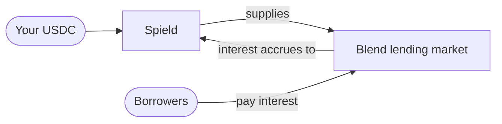

import { Callout } from 'fumadocs-ui/components/callout';

Spield doesn't manufacture yield. It **sources** real yield and restructures it. Understanding
the source is the key to understanding why Spield is safe.

## Your USDC earns real interest

When you deposit, your USDC is supplied to **Blend** — Stellar's primary lending market.
There, borrowers pay interest to use that liquidity, and suppliers (that's your position)
earn it. This is ordinary, transparent lending-market yield.

Spield only ever **supplies** USDC to the lending market — it never borrows. That keeps the
protocol's exposure simple and one-directional.

## Why the backing genuinely grows

This is the most important point in all of Spield.

In the lending market, your supplied USDC is represented by a balance whose **exchange rate
rises over time** as interest accrues. Think of it like a savings-account share price that
only ticks upward: the same number of "shares" is worth more USDC each day.

That means the asset backing your tokens **actually grows on-chain, on its own**. Spield
reads this real, live rate directly from the lending market — it isn't a number anyone sets
by hand, and no privileged party can inflate it.

<Callout title="This is the difference that matters">
  Because the backing is a real position whose value rises automatically, Spield can always
  pay every PT holder their principal *and* every YT holder their yield. The protocol is
  **solvent by construction** — there's no scenario where the value owed exceeds the value
  held. See [Solvency](/docs/how-it-works/solvency).
</Callout>

## "The rate" is the yield

The lending market's rising exchange rate **is** the yield in Spield:

- **PT holders** get their principal back because the position always holds at least enough to cover it.
- **YT holders** get the *growth* — the difference between what the position is worth now and what it was worth when their position started.

When a YT holder claims yield, Spield withdraws exactly the grown amount from the lending
position and pays it out — leaving the principal backing untouched.

## What Spield inherits from the yield source

Sourcing yield from an external market means Spield depends on that market's health. We
state this plainly rather than hide it:

- **If the lending market keeps functioning normally,** Spield works exactly as designed.
- **If the lending market were to pause withdrawals,** payouts would wait on it — but Spield's accounting stays correct and its solvency remains verifiable throughout.

The protocol is built to be conservative here: it uses a deep, blue-chip lending pool, only
supplies (never borrows), and continuously checks that its real position covers everything
it owes.

<Callout type="info" title="Designed to extend">
  Spield's yield source is connected through a thin adapter, so the protocol can support
  additional, high-quality yield sources over time (for example tokenized real-world-asset
  yield) without changing how PT and YT work for users.
</Callout>

Next: [how solvency is guaranteed and verified](/docs/how-it-works/solvency).
