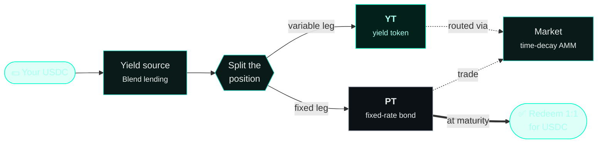

import { Callout } from 'fumadocs-ui/components/callout';
import { Accordion, Accordions } from 'fumadocs-ui/components/accordion';

You only need a few terms to use Spield confidently. Here they are, in plain language.
For a full alphabetical list, see the [Glossary](/docs/resources/glossary).

## The two tokens

### PT — Principal Token

A **PT is a fixed-rate bond**. Each PT redeems for **exactly 1 USDC at maturity**. You buy
it *today* for a little less than 1 USDC, and the gap is your guaranteed return.

> Example: if 1 PT costs **0.97 USDC** today and matures in 90 days, holding it to
> maturity returns **~3.1%** over those 90 days — locked in the moment you buy.

### YT — Yield Token

A **YT is a claim on all the yield** the underlying position earns until maturity. It's
cheap, so a small amount of USDC buys exposure to the yield on a much larger position —
that's the "leverage." If realized yield beats expectations, YT wins; if it
underperforms, YT can decay toward zero.

<Callout title="The invariant that ties them together">
  At every moment, **Value(position) = Value(PT) + Value(YT)**. The protocol never creates
  or destroys value when it splits a position — it only separates it.
</Callout>

## Time and price

<Accordions type="single">
  <Accordion title="Maturity">
    The fixed date when PT becomes redeemable 1:1 for USDC and YT stops earning. Every
    Spield market has one maturity. Think of it as the bond's "end date."
  </Accordion>
  <Accordion title="Par (1.0)">
    The face value of a PT — exactly 1 USDC. As maturity approaches, a PT's market price
    naturally drifts **up to par**, because it's about to be redeemable for a full 1 USDC.
  </Accordion>
  <Accordion title="Discount">
    How far below par a PT trades today (e.g. 0.97). A bigger discount means a higher fixed
    return for buyers — and reflects a higher expected yield.
  </Accordion>
  <Accordion title="Fixed APY">
    The annualized return you lock in by buying PT now and holding to maturity. It comes
    directly from the discount and the time left. It does **not** change after you buy.
  </Accordion>
  <Accordion title="Implied APY">
    The market's *current* view of future yield, read off the PT price. It moves as people
    trade. Buying YT is essentially betting that **realized** yield will beat the **implied**
    APY.
  </Accordion>
</Accordions>

## The pieces of the protocol

| Concept | What it is |
| --- | --- |
| **Yield source** | Where the real yield comes from — Stellar's Blend lending market. Your USDC earns borrower-paid interest there. |
| **Fixed-Rate Vault** | The simplest product: deposit USDC, get a receipt for a guaranteed payout at maturity. You never touch PT/YT directly. |
| **Market** | The trading venue (a time-decay AMM) where PT is bought and sold, and where YT is routed. |
| **Liquidity** | PT + USDC supplied to the market to earn swap fees. |
| **Solvency** | Live, on-chain proof that the protocol's backing covers everything it owes. |

## How they fit together

Once these click, the rest of the docs is just detail. Next: [Key benefits](/docs/introduction/key-benefits)
or the deeper [How It Works](/docs/how-it-works).
